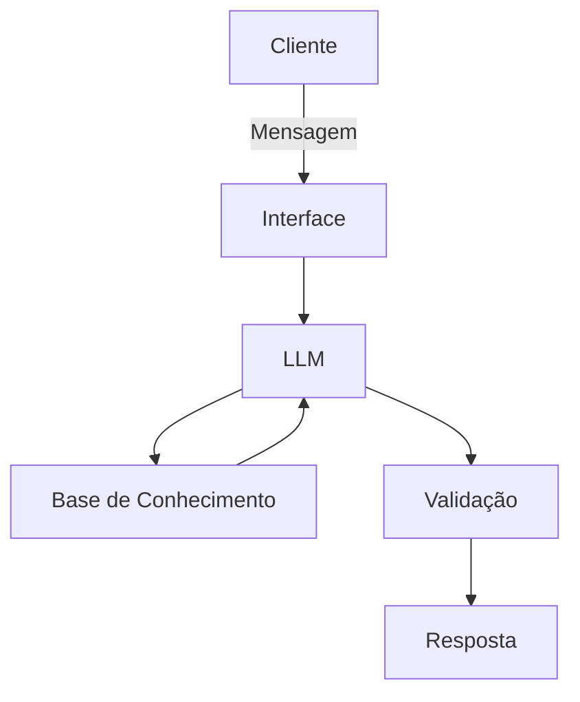

````
# 📌 Projeto Agente Financeiro Educacional (Rê)

Este repositório contém um **agente de inteligência artificial voltado à educação financeira**, desenvolvido como parte de um projeto do bootcamp da Digital Innovation One (DIO).  
O projeto traz uma documentação estruturada e uma base de conhecimento própria que guiam seu funcionamento.

---

## 💡 Visão Geral

O objetivo é criar um **agente conversacional educacional** chamado **Rê** (educadora de reserva financeira), que ajuda **jovens a organizar suas finanças, criar hábitos de poupança e planejar uma reserva de emergência**.  
Ele sugere metas, ações práticas e acompanha o progresso do usuário de forma educativa e acessível.

---

## 🧠 Como o Agente Funciona

### 🔹 Problema que Resolve
Muitos jovens não sabem como:
- organizar despesas,
- criar hábito de poupar,
- iniciar uma reserva de emergência.

### 🔹 Solução Proposta
O agente:
- define metas financeiras personalizadas
- sugere ações práticas
- acompanha progresso financeiro
- usa linguagem acessível e educativa

---

## 📊 Arquitetura

O sistema possui a seguinte estrutura:
Cliente
   │
   ▼
Interface (ex: Streamlit)
   │
   ▼
LLM
   │
   ▼
Base de Conhecimento
   │
   ▼
Validação
   │
   ▼
Resposta
````

Componentes principais:

* **Interface:** front‑end para interação com o usuário (ex.: web app)
* **LLM:** modelo de linguagem responsável pelas respostas
* **Base de Conhecimento:** dados financeiros e históricos para contexto
* **Validação:** checagem de respostas e prevenção de alucinações([GitHub][1])



---

## 📚 Base de Conhecimento

A base de dados contém:

| Arquivo                     | Formato | Uso                                        |
| --------------------------- | ------- | ------------------------------------------ |
| `historico_atendimento.csv` | CSV     | Contexto de atendimentos anteriores        |
| `perfil_investidor.json`    | JSON    | Ajuste de respostas com base no perfil     |
| `produtos_financeiros.json` | JSON    | Produtos ideais para reserva de emergência |
| `transacoes.csv`            | CSV     | Padrões de gastos e simulação financeira   |

Foram feitas adaptações, por exemplo:

* remoção de produtos de alto risco
* inclusão de simulações de reserva de emergência nos dados ([GitHub][2])

---

## 📝 Exemplos de Uso de Dados

Exemplo de contexto montado para o agente:

```
Dados do Cliente:
- Nome: João Silva
- Perfil: Moderado
- Renda Mensal: R$5.000
- Objetivo: Construir reserva de emergência
```

Transações e produtos recomendados são usados para personalizar respostas.([GitHub][2])

---

## 📌 Prompts e Estratégias

Os prompts usados para guiar o agente (como system prompts, exemplos de diálogo e resposta ideal) estão documentados na pasta `docs/03-prompts.md`.
Eles controlam tom de voz, regras e restrições claras para o agente.([GitHub][3])

---

## 📏 Métricas de Avaliação

O projeto também define métricas e critérios para avaliar a qualidade, relevância e segurança das respostas do agente (detalhado no `docs/04-metricas.md`).([GitHub][4])

---

## 🚀 Pitch

Uma apresentação curta do projeto (como se fosse feita para investidores ou para um evento) está em `docs/05-pitch.md`, e pode ser reutilizada em apresentações, portfólio ou README estendido.([GitHub][5])

---

## 🧪 Como Rodar

(Coloque aqui instruções reais dependendo do seu setup – por exemplo, se usa Python, Streamlit, container etc.)

Exemplo:

```bash
git clone https://github.com/PedroVBMNogueira/dio-lab-bia-do-futuro.git
cd dio-lab-bia-do-futuro
# Instalar dependências
pip install -r requirements.txt
# Rodar localmente
streamlit run app.py
```

---

## 📁 Estrutura do Projeto

```text
📦 dio-lab-bia-do-futuro
├─ docs/                   # Documentação detalhada
├─ data/                   # Dados usados no agente
├─ src/                    # Código-fonte principal
├─ README.md
└─ ...
```

---

## 🧑‍💻 Autor

Desenvolvido por **Pedro Nogueira**
🔗 [https://github.com/PedroVBMNogueira](https://github.com/PedroVBMNogueira)

---

## 📄 Licença

MIT License

---
